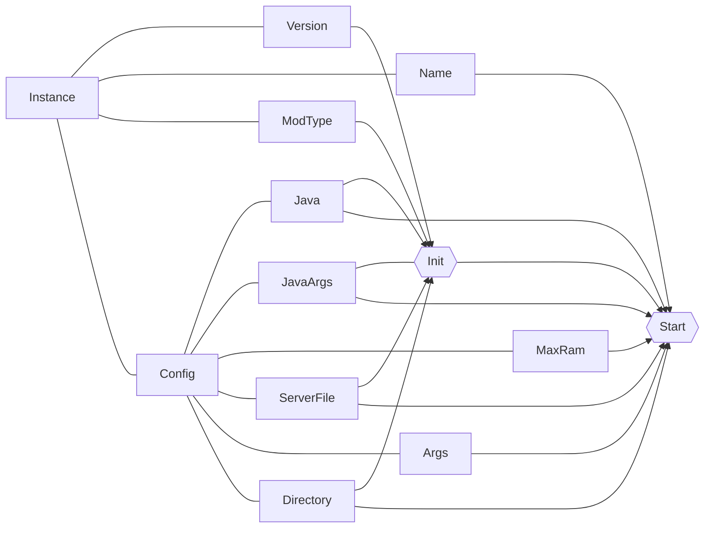

# Instance implementation

```mermaid
graph LR
    Instance --- Version
    Instance --- Name
    Instance --- ModType
    Instance --- Config
    
    Config --- Java
    Config --- JavaArgs
    Config --- MaxRam
    Config --- ServerFile
    Config --- Args
    Config --- Directory
    
    Version --> Init{{Init}}
    ModType --> Init
    Directory --> Init
    ServerFile --> Init
    Java --> Init
    JavaArgs --- Init
    
    Name ---> Start{{Start}}
    Java ---> Start
    JavaArgs ---> Start
    MaxRam --> Start
    ServerFile ---> Start
    Args ---> Start
    Directory ---> Start
    
    Init ---> Start
```